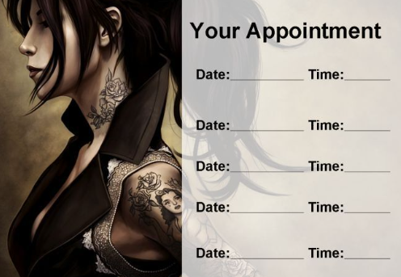

# API REST para Gestión de Citas de un Estudio de Tatuajes

## Descripción

El proyecto consiste en desarrollar una API RESTful para la gestión de citas de un estudio de tatuajes. La API permitirá a los usuarios registrarse en la aplicacio,iniciar sesión y acceder a su área personal.Dentro de su área, podrán visualizar una lista de las citas programadas para servicios de tatuajes y piercing,así como crear nuevas citas para diversos servicios que ofrece el estudio.

## Características Principales

- Gestión de Citas
- Gestión de Servicios
- Gestión de Usuarios
- Edición de Perfil de Usuario
- Registro y Login de Usuarios

## Endpoints principales

### Autenticación

| Método | URI                  | Acción               |
| ------ | -------------------- | -------------------- |
| POST   | `/api/auth/register` | Registro de usuarios |
| POST   | `/api/auth/login`    | Login de usuarios    |

### Usuarios

| Método | URI                  | Acción                     |
| ------ | -------------------- | -------------------------- |
| GET    | `/api/users/`        | Ver todos los usuarios     |
| GET    | `/api/users/profile` | Ver perfil usuario         |
| PUT    | `/api/users/profile` | Modificar Datos del perfil |
| DELETE | `/api/users/:id`     | Eliminar Usuario           |

### Citas

| Método | URI                     | Acción                |
| ------ | ----------------------- | --------------------- |
| POST   | `/api/appointments`     | Crear cita            |
| PUT    | `/api/appointments`     | Actualizar cita       |
| GET    | `/api/appointments/:id` | Recuperar cita        |
| GET    | `/api/appointments`     | Ver mis propias citas |
| DELETE | `/api/users/{id}`       | Elimina usuario       |
| GET    | `/api/users/{id}/loans` | Préstamos por usuario |
| PUT    | `/api/users/{id}/role`  | Cambiar rol           |

### Servicios

| Método | URI             | Acción                  |
| ------ | --------------- | ----------------------- |
| GET    | `/api/services` | Ver todos los servicios |

## Tecnologías

<a id="stack">Stack</a>

- ORM: 
- Language: 
- Framework: 
